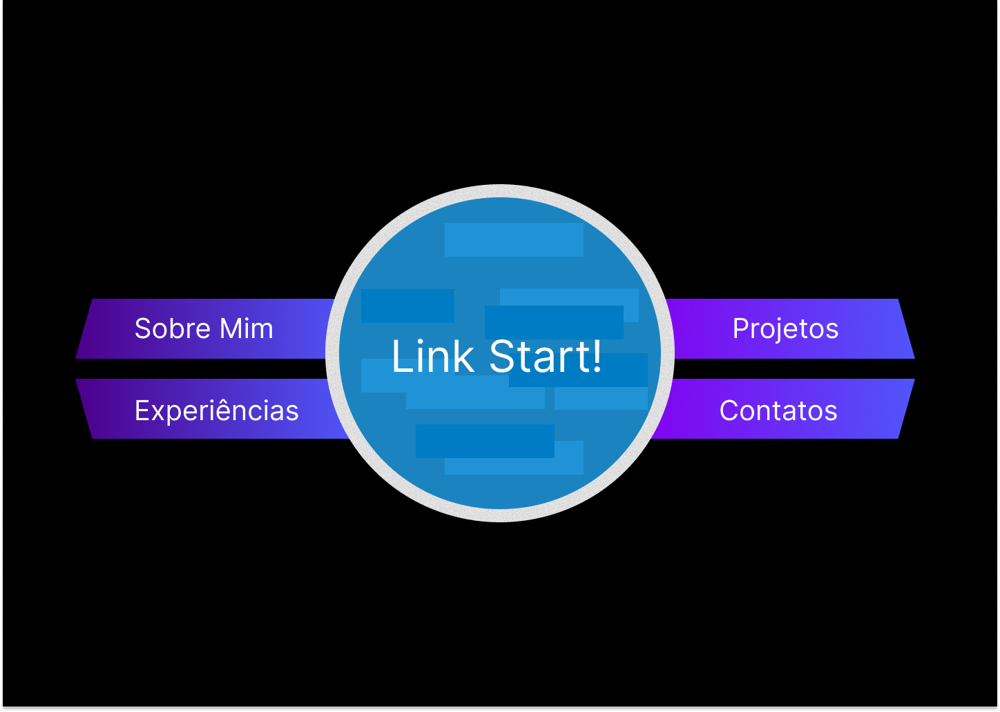
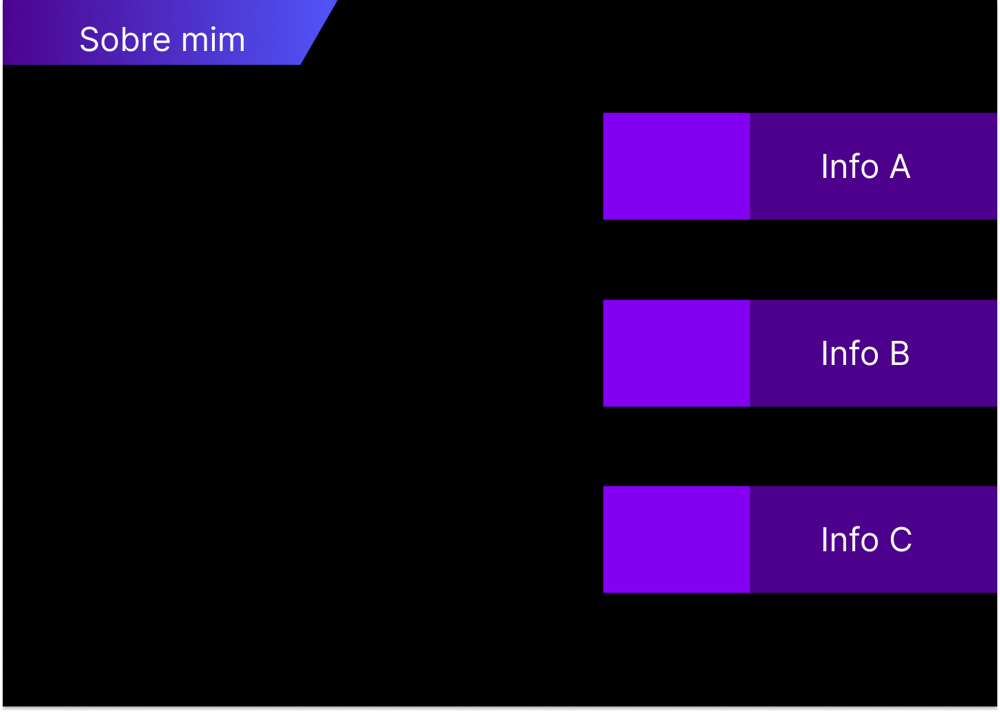
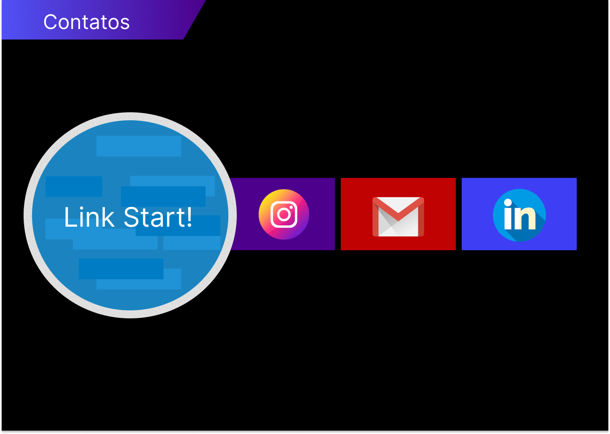
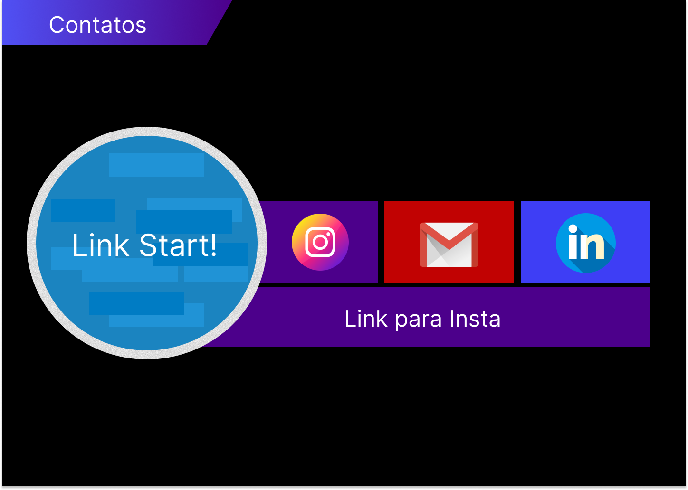
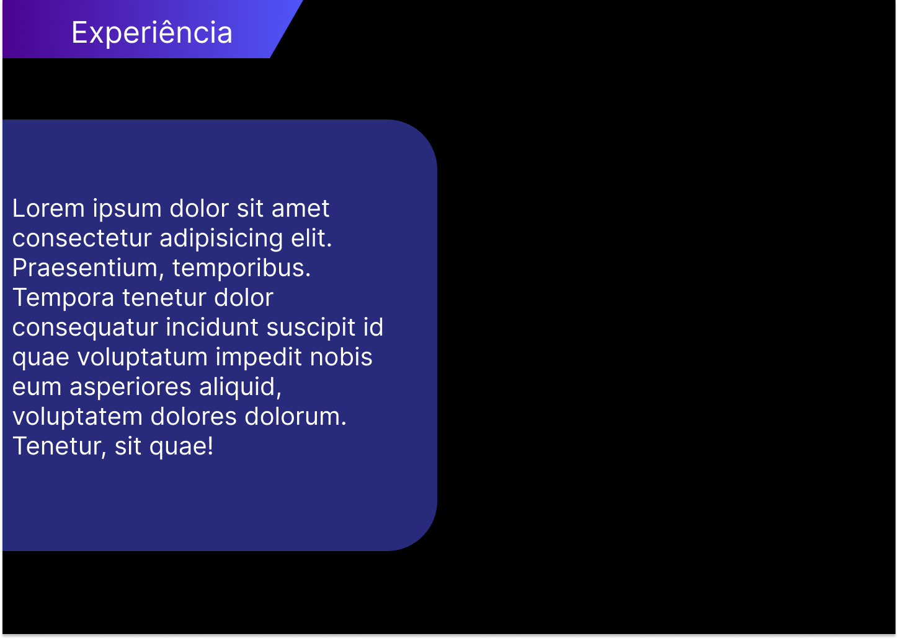
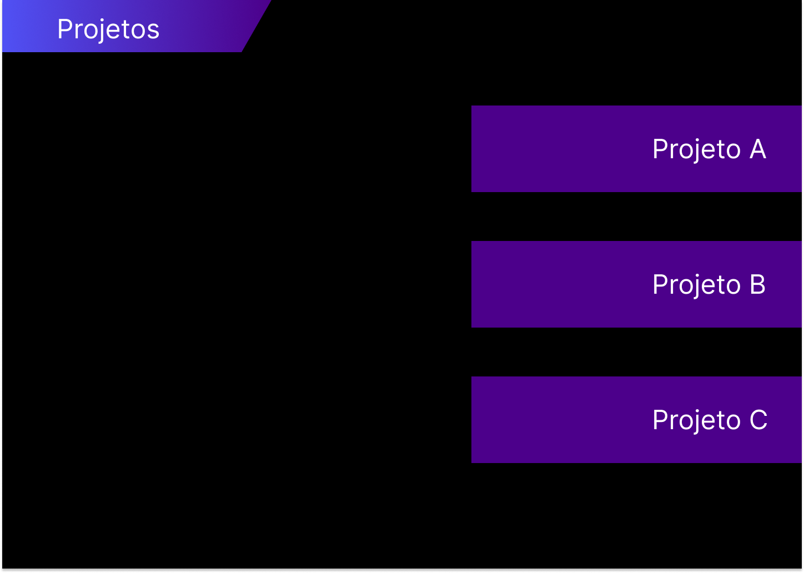

# 🚀 Portfólio Profissional – Tema Jogo de Ritmo

## 📝 Enunciado
O objetivo é desenvolver um website de portfólio profissional, que apresente sua trajetória, habilidades, projetos e formas de contato de maneira moderna e acessível.

---

## 📖 Sobre
Um portfólio com tema de **Jogo de Ritmo**, criado como parte de uma atividade da disciplina **Laboratório de Desenvolvimento de Software**.

---

## 🌌 Funcionalidades
- Apresentação profissional com design temático musical  
- Seções para trajetória, habilidades, projetos e contato  
- Layout moderno e responsivo  

---

## 🛠 Tecnologias Utilizadas

<div style="display: flex; align-items: center; gap: 8px;">
  
  <span><strong></strong></span> 
  
  <span><strong></strong></span> 
  
  <span><strong></strong></span> 
  
  <span><strong></strong></span> 
</div>

---

## 📂 Estrutura do Projeto
```  bash
├── docs/                     
│   └── portfolio/             
├── public/                    
│   └── vite.svg                                             
├── src/                       
│   ├── components/            
│   │   ├── Circle.jsx
│   │   └── MainButton.jsx
│   ├── pages/                
│   │   ├── App.jsx            
│   │   └── main.jsx          
│   └── styles/               
│       └── index.css          
├── .gitignore                 
├── .eslintrc.js               
├── index.html                 
├── LICENSE                    
├── package.json              
├── package-lock.json          
├── README.md                  
└── vite.config.js   
``` 
---

## 🎵 Wireframes

Abaixo estão os wireframes desenvolvidos para o projeto:

<div align="center">

|                     Tela Inicial                     |                Sobre mim                 |
| :------------------------------------------------------: | :-------------------------------------------: |
|  |  |

|                  Contatos                  |                   Contatos - Aberto                    |
| :---------------------------------------------: | :-------------------------------------------------: |
|  |  |

|                 Experiencia                  |            Projetos             |
| :-------------------------------------------: | :-----------------------------------------------: |
|  |  |

</div>

---

## 🤝 Contribuidores
<div style="display: flex; align-items: center; gap: 8px;">
  
  <span><strong></strong></span>
</div>

